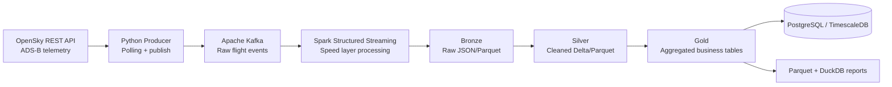

# SkyPulse Streaming — Real-Time Flight Intelligence Pipeline

A production-oriented starter scaffold for an end-to-end real-time flight tracking data platform using OpenSky telemetry, Kafka, Spark Structured Streaming, and a Medallion data architecture.

## High-level architecture



## Tech stack


## Repository structure

```text
.
├── docker/
│   └── docker-compose.yml
├── src/
│   ├── producers/
│   ├── streaming/
│   └── batch/
├── data/
│   └── reference/
├── notebooks/
├── tests/
│   ├── unit/
│   └── integration/
├── decisions/
├── .env.example
├── .gitignore
├── requirements.txt
└── README.md
```

## Prerequisites

- Python 3.11+
- Docker + Docker Compose
- Java 11+ (required for local Spark)

## Quick start

1. **Create local environment file**
   ```bash
   cp .env.example .env
   ```
2. **Install Python dependencies**
   ```bash
   pip install -r requirements.txt
   ```
3. **Start infrastructure services**
   ```bash
   docker compose -f docker/docker-compose.yml up -d
   ```
4. **Begin implementing pipeline components**
   - `src/producers/`: OpenSky polling and Kafka producer
   - `src/streaming/`: Spark Structured Streaming transforms
   - `src/batch/`: daily gold aggregations/reporting jobs

## Notes

This repository currently provides skeleton structure and orchestration only. Business logic for ingestion and transformations is intentionally left unimplemented.
